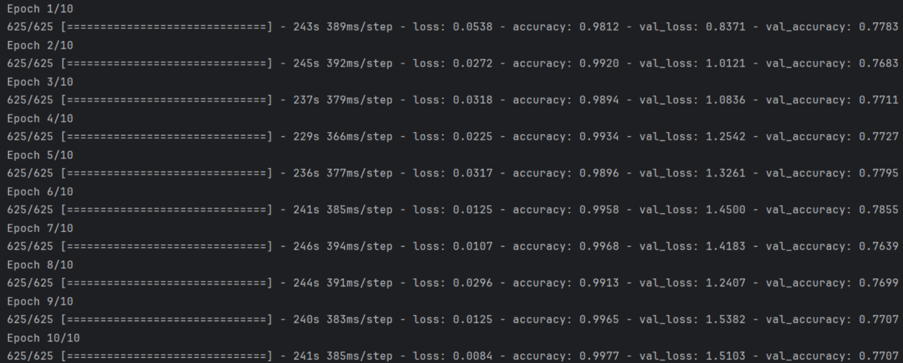

# CNN-Based Image Classification Project

## Overview
This project explores various convolutional neural network (CNN) architectures and transfer learning techniques for image classification. The goal is to analyze model performance on a binary classification task using different approaches, including fully connected networks, convolutional networks, and pre-trained models (VGG19, ResNet50).

## Project Structure
- `classes/` - Directory with helper classes for data processing and visualization.
- `data/` - Contains training, validation, and test datasets.

## Implementation

Google Colab: [Link](https://colab.research.google.com/drive/1pJ4aQ3kkB7eyLK3-Gjm3yiJiAGcTTnZ5?usp=sharing)

### Data Preparation
```python
target_size = (150, 150)
train_generator, valid_generator, test_generator = ImageGenerator.get_train_valid_test_generators(target_size);
```


### Model Architectures

```python
epochs = 5
```
#### Fully Connected Neural Network
```python
model_1_name = 'Fully Connected NN'
model_1 = Sequential([
    Flatten(input_shape=(150, 150, 3)),
    Dense(512, activation='relu'),
    Dense(256, activation='relu'),
    Dense(128, activation='relu'),
    Dense(1, activation='sigmoid')
])

history_1 = ModelProcessor.compile_and_fit_model(model_1, train_generator, epochs, valid_generator)

```


#### Convolutional Neural Network (CNN)
```python
model_2_name = 'Convolutional NN'
model_2 = Sequential([
    Conv2D(32, (3, 3), activation='relu', input_shape=(150, 150, 3)),
    MaxPooling2D((2, 2)),
    Conv2D(64, (3, 3), activation='relu'),
    MaxPooling2D((2, 2)),
    Flatten(),
    Dense(64, activation='relu'),
    Dense(1, activation='sigmoid')
])

history_2 = ModelProcessor.compile_and_fit_model(model_2, train_generator, epochs, valid_generator)
```


### Transfer Learning (VGG19 & ResNet50)
```python
model_3_name = 'VGG19'
model_3 = VGG19(
    weights='imagenet',
    include_top=False,
    input_shape=(150, 150, 3)
)

history_3 = ModelProcessor.compile_and_fit_model(model_3, train_generator, epochs, valid_generator, False)
```
```python
model_4_name = 'ResNet50'
model_4 = ResNet50(
    weights='imagenet',
    include_top=False,
    input_shape=(150, 150, 3)
)

history_4 = ModelProcessor.compile_and_fit_model(model_4, train_generator, epochs, valid_generator, False)
```


### Model Performance Evaluation
```python
ModelProcessor.evaluate_model(model_1, test_generator, model_1_name)
ModelProcessor.evaluate_model(model_2, test_generator, model_2_name)
ModelProcessor.evaluate_model(model_3, test_generator, model_3_name)
ModelProcessor.evaluate_model(model_4, test_generator, model_4_name)
```


Model Training After increasing epochs:
```python
epochs_retrain = 10
```
```python
history_5 = ModelProcessor.fit_model(model_1, train_generator, epochs_retrain, valid_generator)
history_6 = ModelProcessor.fit_model(model_2, train_generator, epochs_retrain, valid_generator)
```



Model Performance Evaluation After increasing epochs:
```python
ModelProcessor.evaluate_model(model_1, test_generator, model_1_name)
ModelProcessor.evaluate_model(model_2, test_generator, model_2_name)
```


### Learning Curves Visualization
```python
DataVisualizer.plot_train_curves(history_5, history_6, model_1_name, model_2_name)
DataVisualizer.plot_loss_curves(history_5, history_6, model_1_name, model_2_name)
```


## Key Takeaways
- **Fully Connected NN:** Struggled with accuracy (~58%), confirming the limitations of dense-only architectures for image classification.
- **CNN:** Significantly improved classification performance (79%) by leveraging convolutional layers.
- **VGG19:** Achieved the highest accuracy (88%), demonstrating the power of pre-trained deep architectures.
- **ResNet50:** Had lower accuracy (71%) than expected, possibly due to limited dataset size or inadequate fine-tuning.
- **Overfitting:** Training performance was strong, but validation performance degraded over time, indicating potential overfitting.

### Possible Improvements
- **Data Augmentation:** Introduce transformations like rotation, flipping, and zooming to increase dataset variability.
- **Regularization Techniques:** Apply dropout layers, batch normalization, and L2 regularization to prevent overfitting.
- **Fine-tuning Pre-trained Models:** Unfreeze deeper layers in VGG19 and ResNet50 for better feature extraction.
- **Exploring Other Architectures:** Try EfficientNet, MobileNet, or custom CNN architectures for better trade-offs between performance and efficiency.

---
This project was created as part of my exploration of deep learning for image classification. 🚀
